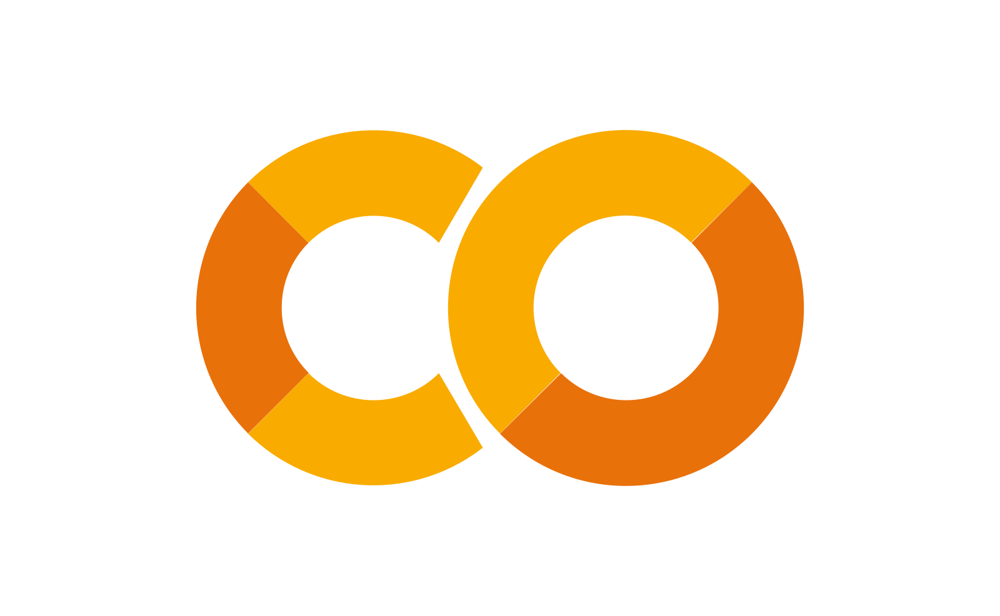

 

 

##

Hi! My name is Vivek Mehta, an ambitious rising High School senior with a love for **computer science**! 

I love to code because I love breaking down problems into smaller parts, utilizing my problem-solving and creative skills. I love sharing this passion with others & I'm always excited to meet new people. 

I'm fascinated with theoretical computer science, control theory, and automation (mostly from my fanatic robotics and competitive programming adventures), especially when they are applied in other disciplines such as biology. Recently, I've begun my journey into studying AI & Data science, but I also enjoy game & web development.

*Here are a few of my projects~*
- **VEX Robotics** - [Team 66659a](https://www.robotevents.com/teams/V5RC/66659A)
  - I've been lucky to have been part of such a great team and environment. I was the sole coder on our team when we were all freshman, but since then I have been able to take pivotal roles within leading the team as the software lead and club captain. My GitHub page contains the codebase for three VEX seasons: Tipping Point, Spin Up, & Over Under. 
- **Slime Combine!**
  - [This project](https://itch.io/jam/brackeys-5/rate/928475) was built in under a week with [@citrus-melon](https://github.com/citrus-melon), for a Brackey's Game Jam hosted on itch.io. Out of the 1824 entries in the jam, we scored #33rd in Game Design & #64th in Overall categories.  
- **Simulations!**
  - I like messing around with p5js to create cool simulations, although I'm still learning a lot!
    - I made a randomized circle generator I made for my Calculus final project. This website generates circles within a certain area and applies a pink-blue gradient for aesthetic purposes! I'm currently trying to utilize this to create my own rendition of a [famous internet meme](https://en.wikipedia.org/wiki/Bad_Apple!!#Usages_in_meme_culture)-"If it can render, it can render Bad Apple". In all seriousness, feel free to check out a copy of the accompanied slides in the [repository linked](https://github.com/viv511/CirclePacking)!
- **Competitive Programming**
  - I find competitive programming really enjoyable because it allows me to think critically and find fun coding solutions to Farmer John's cow-related problems (hehe). I've been able to compete in a few contests, and I'm always looking to improve my skills.
  - [USACO](https://usaco.org/) Silver // [M(IT)^2](https://mitit.org/Contest/Archive/Results2024Winter) - 2nd Place in Division // [Codeforces](https://codeforces.com/profile/viv511)
- **Hackathons**
  - I love hackathons because they bring so many people together from diverse backgrounds to work on a common goal (and theres usually food and prizes involved >:) ).
  - [LexHack](https://lexhackathon.org/) is a student-led 501(c)(3) nonprofit that my friends and I created in late 2021, and so far we have had two successful events! LexHack aims to provide middle and high school students with opportunities to learn and showcase their computer programming skills at yearly hackathons. We have raised over $10k in prizes and have had 250+ participants! 
  - I've attended [MIT Blueprint](https://blueprint.hackmit.org/) for two years, and have met a lot of really cool people through its community! 
    - Along with my friends, we made [BobaGuessr](https://github.com/BrilliantDeviation7/BobaGuessr) in 2023 and [TaskApp](https://github.com/connorcarey/task-app) in 2024!

~viv511

<h1 align="center"> Languages and Skills: </h1>

 

<!--   -->

 

 

 

 

 

 

 

 

 

 
 
 

<h1 align="center"> Contributions & Stats: </h1>

  

 

  

 
  

<!-- bg_color=edbfff -->

<!-- Here are some ideas to get you started:
    **viv511/viv511** is a ✨ _special_ ✨ repository because its `README.md` (this file) appears on your GitHub profile.

- 🔭 I’m currently working on ...
- 🌱 I’m currently learning ...
- 👯 I’m looking to collaborate on ...
- 🤔 I’m looking for help with ...
- 💬 Ask me about ...
- 📫 How to reach me: ...
- 😄 Pronouns: ...
- ⚡ Fun fact: ...

--> 
